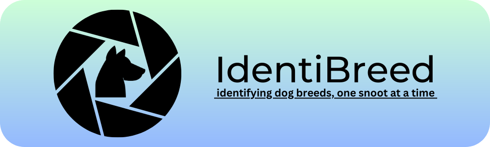

# IdentiBreed - The dog breed identification AI

    

This here repository represents a project I started doing during an online course. Upon finishing said course I decided to expand and further work on this model.

In simple words - if you've got a picture of a dog, this should be able to recognize it! As long as it's breed is within the 120 ones given by Kaggle, but I will get onto that in a bit...

## Requirements

So far only two, I'm sure of only the OS and not entirely as well...

- A screen resolution of at least 1440x900 (It will work on smaller resolutions, but there are no means of scrolling right now)
- Currently supported operating systems:
  - 🍎 MacOS - ✅ - the app works swimmingly on the M1 macs, on M2 probably as well. Not sure about the intel ones, the user might need to install some packages. I will try to test it in the future...
  - 🪟 Windows - ⛔️ - next in line for testing but not working yet. Might require some changes to the code and certainly a creation of its very own `dl-env.yml` file
  - 🐧 Linux - ❓ - I mean it's Unix but I bet it won't work as supposed to... I've got no way to check it though sadly. At least for now.

## Background

Through this repository (and more specifically the `IdentiBreed.ipynb` notebook) I'm tackling a multi-class classification problem. Kaggle, through its 2017 <a href="https://www.kaggle.com/competitions/dog-breed-identification">"Dog Breed Identification"</a> competition equipped us with over 10k images of different dog breeds, which we can use to train models in recognising said breeds. Then, we were expected to make predictions on a test set and submit them in a .csv format.

I said 'were' above since the competition has already finished, but we can still post late submissions and get evaluation scores on how our models performed.

## What to expect?

I set out to create a model using a network imported from TensorFlow Hub. I decided on a MobileNet v2 based model, which takes 244 x 244 images as input. In the `IdentiBreed.ipynb` notebook I efectively take my first steps in creating a transfer learning model, and I declare all necessary functions as I go along. Originally it was done with a help of an online course, but after finishing it I came back and improved this notebook as much as I could.

## What's already happened?

Inital model has been completed a long time ago (some time in April) and then I set out to expand on the project.

<i>-- 18.06.2023 version 0.2.0 --</i>

Can I call this version 0.2.0? I mean it's my own project and I guess I can do what I want...

This is a rather major of minor updates as it tackles a few things:

- I reworked the input sources! Now users can use the original input folder provided by the app, they can select a specific directory or file where the images are or they can paste a URL to an image.
- I reworked the saving system AGAIN. This time I moved the buttons to their own designated `LabelFrame` widget and moved the `Output Folder` button here as well. Now you can access the saved images from this place, which frankly makes more sense than storing this button in the input section...
- I updated the `dl-env.yml` file with a new package that helps us to...
- ... resize the plot! Yes, I made the plot resize according to the resolution of the user's screen
- I made sure to provide a rather high dpi for the prediction figure, which makes it readable after saving on larger resolutions
- I cleaned up the code, provided docstrings to all functions and methods created so far

Now there's nothing left to do but work on asking the user for evaluation and expanding the database...

<i>-- 15.06.2023 version 0.1.1 --</i>

Minor update - reworked the prediction saving system. Now after making predictions on the image files - before displaying the predictions - you have to decide whether you want all images saved, none saved or if you want to pick them manually. Then if you want to make new predictions the save system resets and you have to choose again how you want saving handled.

Next in line - making some change to the input system (maybe something akin to a droppable image or picking a direct path to the image) and working on rescaling the predicted image and the UI, since it looks funny on 4K screens...

<i>-- 12.06.2023 version 0.1.0 --</i>

Since the last update I focused on creating a windowed version of the app using the `tkinter` module. Now, if you run the `IdentiBreed.py` file within an active Conda env (please use the `dl-env.yml` to recreate the environment) you're greeted to a simple, rather user-friendly window.

Under the banner you will see three divisions that you can interact with! Let me go through each one of them:

- `User Images Input/Output` - As the text label suggests, if you click on either "Input Folder" or "Output Folder" buttons Finder/Explorer will open new windows. In order to give the app files to predict place your images inside of the "Input folder". If you check the box right under those buttons, all saved predictions will appear inside "Output folder".
- `Predict Breeds` - Just one button here, before you click it make sure you've decided whether you want your images saved or not since you won't be able to change it later. As you click "Make Predictions", you let IdentiBreed do what it's best at - predicting dog breeds from images. The banner will change to a figure containing a labeled image and top 5 predicted labels.
- `Navigation Controls` - Once IdentiBreed's made predictions on your images you will get access to those controls. The counter will display which image out how many it is showing, and the buttons "< Previous" and "Next >" will take you through all of your predictions! Easy as that!

<i>-- 26.05.2023 Initial .ipynb files --</i>

The repostiory was updated with this new notebook `Identifyin_User_Images.ipynb` and two files containing functions defined so far - `model_funcs.py` and `user_funcs.py`. Now the user can give model their images, see what breeds the model thinks are present in these images and if they want save those outputs for them. Alongside these the images are saved (currently locally) in 'user_submissions' directory within './data/' with the correct breed as label. This in future will allow me to gather those images and use them for retraining the network.

## What's next?

Three boxes down, one new and four old ones to go...

From now on I will focus on expanding the app with few more controls. I want to make the user evaluate the breeds in the same way as in the `Identifying_User_Images.ipynb`. This will require a `LabelFrame` with about three or four buttons and a combobox. I played around a bit with a possible UI, so implementation won't take very long.

Next up I will have to consider expanding the training dataset, since it's missing some dog breeds (for instance the internet staple - the Doge itself - both 'shiba' and 'akita' breeds).

That's as far as my goals stretch for now. Another goal I can consider is putting the model up on my portfolio website, as a web accessible breed identifier. And some more things like streamlining the notebooks, creating a new iteration of IdentiBreed that's from the ground up mine etc.

So to sum up the goals (present and future):
  ✅ Create the first iteration of IdentiBreed
  ✅ Prepare model to make predictions on user submitted pictures
  ✅ Put the model and most of the obligatory functions into a windowed app
  ◽️ Add prediction evaluation and dataset expansion
  ◽️ Expand the training dataset with missing dog breeds
  ◽️ Make the model web accessible
  ◽️ Streamline the notebooks
  ◽️ Rebuild the model from ground up (no TensorFlow Hub)
